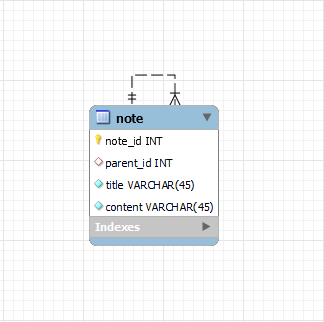
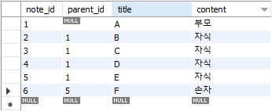

# [팀 과제 / 면접 4팀] 노션에서 브로드 크럼스(Breadcrumbs) 만들기

## 1. 목표

> 노션과 유사한 간단한 페이지 관리 API를 구현해주세요. 각 페이지는 제목, 컨텐츠, 그리고 서브 페이지를 가질 수 있습니다. 또한, 특정 페이지에 대한 브로드 크럼스(Breadcrumbs) 정보도 반환해야 합니다.

## 2. 요구사항

**페이지 정보 조회 API**: 특정 페이지의 정보를 조회할 수 있는 API를 구현하세요.

- 입력: 페이지 ID
- 출력: 페이지 제목, 컨텐츠, 서브 페이지 리스트, **브로드 크럼스 ( 페이지 1 > 페이지 3 > 페이지 5)**
- 컨텐츠 내에서 서브페이지 위치 고려 X

## 3. 테이블 구조 (ERD)



## 4. 테스트 데이터 환경

### [1] Dummy Data



### [2] 페이지 Depth

- A 페이지
  - B 페이지
  - C 페이지
  - D 페이지
  - E 페이지
    - F 페이지

## 5. 비지니스 로직

1. 새로운 페이지 생성 시 해당 페이지가 최상위 페이지면 `parent_id`를 `null`로, 반대로 부모 페이지가 존재한다면 해당 부모의 `note_id`로 등록합니다.

2. `parent_id` 와 요청으로 받은 `note_id` 값이 일치하는 행들의 `title`을 반환하여 `subPages` 필드를 만족시킵니다.

```sql
  SELECT note_id, title
  FROM note
  WHERE parent_id = ${ntoe_id}
```

3. 요청으로 받은 `note_id` 와 일치하는 행의 `parent_id` 의 값이 `null` 이 되기 전 까지 재귀적으로 pooling 하면서, 해당 행의 `title` 값을 순차적으로 배열에 추가하여 `breadcrumbs` 필드를 만족시킵니다.

```sql
  SELECT note_id, title, content, parent_id
  FROM note
  WHERE note_id = ${ntoe_id}
```

## 6. 결과 정보

### [1] 현재 페이지 : A

> A

```
curl --location --request GET 'http://localhost:5500/api/v1/notes/1'
```

```json
{
  "message": "페이지 정보 조회 성공",
  "data": {
    "note_id": 1,
    "title": "A",
    "content": "부모",
    "subPages": ["B", "C", "D", "E"],
    "breadcrumbs": ["A"]
  }
}
```

### [2] 현재 페이지 : B

> A / B

```
curl --location --request GET 'http://localhost:5500/api/v1/notes/2'
```

```json
{
  "message": "페이지 정보 조회 성공",
  "data": {
    "note_id": 2,
    "title": "B",
    "content": "자식",
    "subPages": [],
    "breadcrumbs": ["A", "B"]
  }
}
```

### [3] 현재 페이지 : F

> A / E / F

```
curl --location --request GET 'http://localhost:5500/api/v1/notes/6'
```

```json
{
  "message": "페이지 정보 조회 성공",
  "data": {
    "note_id": 6,
    "title": "F",
    "content": "손자",
    "subPages": [],
    "breadcrumbs": ["A", "E", "F"]
  }
}
```
